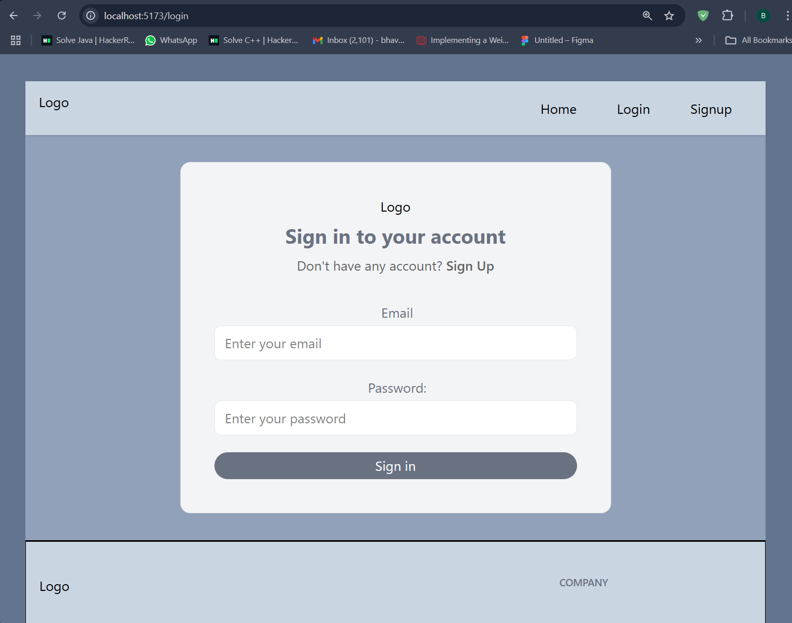
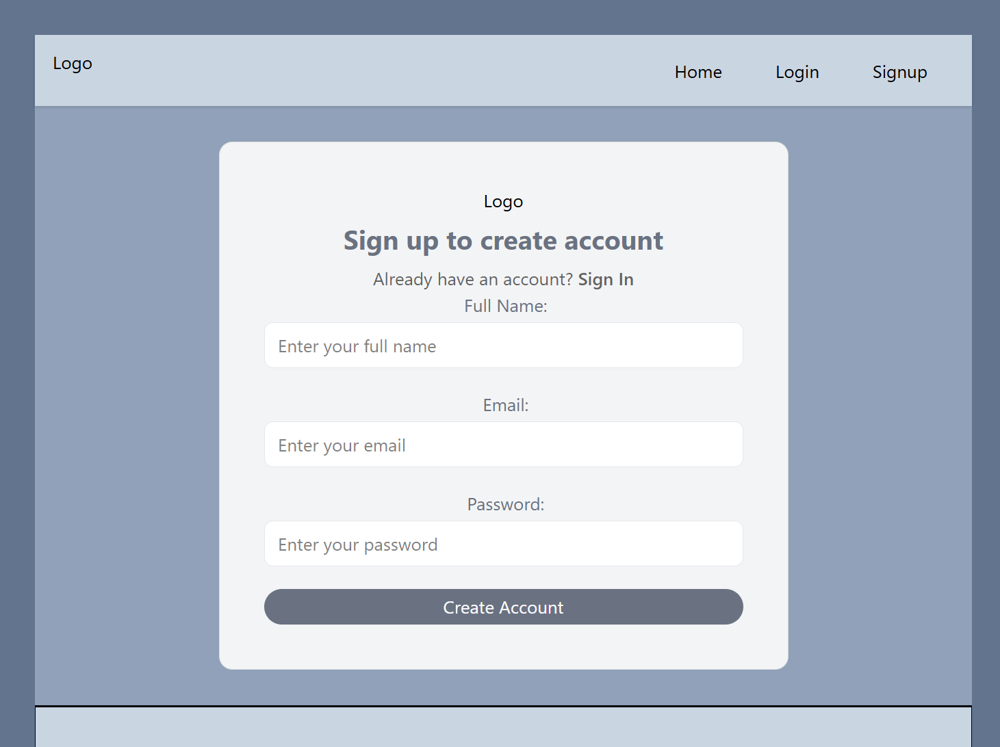
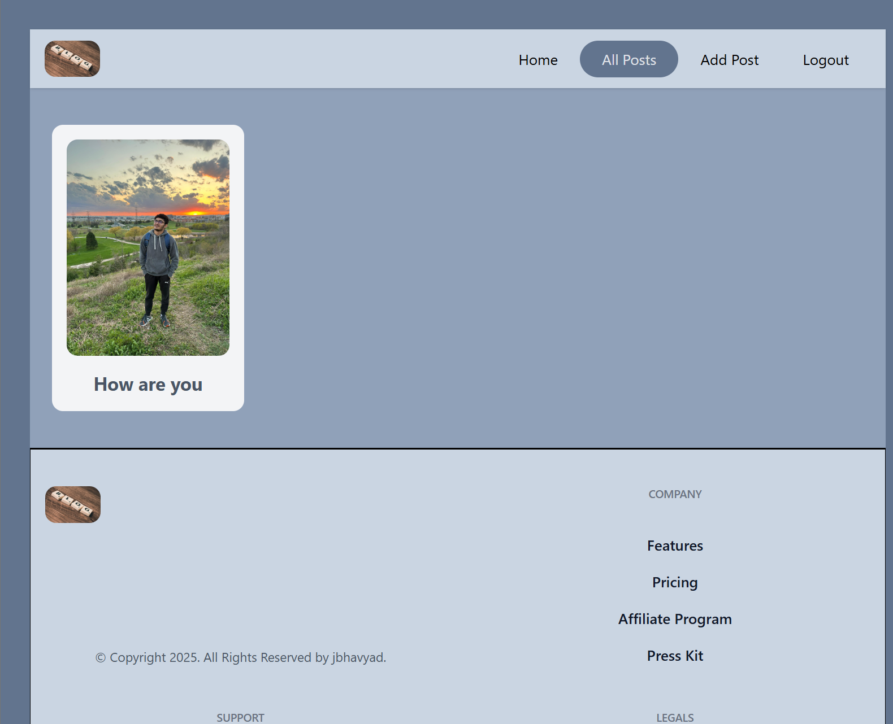

# 📝 React Blog Application with Appwrite

This is a full-featured blog application built with **React** and powered by **Appwrite** as the backend-as-a-service (BaaS). It includes functionality for user authentication, creating and editing posts, and a beautiful UI for reading blog content. It leverages modern tools like **Redux Toolkit**, **TinyMCE**, **React Hook Form**, and **Tailwind CSS** for an optimized developer and user experience.

---

## 🚀 Features

- 🔐 User authentication (Sign up / Sign in / Sign out)
- 📝 Create, edit, and delete blog posts
- 💬 Rich text editing using TinyMCE
- 🧠 State management with Redux Toolkit
- ✅ Form validation and handling using React Hook Form
- 🧭 Client-side routing with React Router DOM
- 🎨 Fully responsive and modern UI built with Tailwind CSS

---

## 🛠️ Tech Stack

| Frontend              | Backend (BaaS) | Others                    |
|-----------------------|----------------|---------------------------|
| React                 | Appwrite       | Redux Toolkit             |
| Tailwind CSS          |                | React Hook Form           |
| React Router DOM      |                | TinyMCE (Rich Text Editor)|
|                       |                | Appwrite SDK              |

---

## 📸 Screenshots





---

## 📦 Installation

### Prerequisites

- Node.js and npm
- Appwrite project and self-hosted instance or Appwrite Cloud

### Steps

```bash
# 1. Clone the repo
git clone https://github.com/jbhavyadeep/BlogCreator.git
cd BlogCreator

# 2. Install dependencies
npm install

# 3. Set up environment variables (see below)

# 4. Run the application
npm run dev
